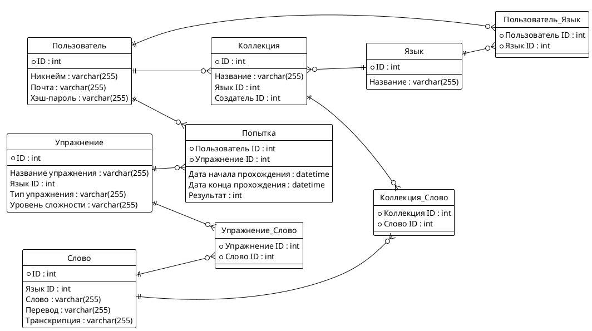

# Лабораторная работа №1: Проектирование реляционной модели данных

## 1. Цель работы

Освоить методологию проектирования реляционных баз данных путем создания концептуальной и логической модели данных для заданной предметной области. Сформировать практические навыки разработки ER-диаграмм и их реализации на языке SQL.

## 2. Задачи работы

1. Проанализировать предложенную предметную область и выделить ключевые сущности
2. Определить атрибуты сущностей и связи между ними
3. Спроектировать ER-диаграмму в нотации PlantUML
4. Реализовать модель данных в виде SQL DDL скрипта
5. Обосновать выбранные типы данных и структуру таблиц

### Вариант 19: Приложение для изучения языков (Vocabulary Trainer)

**Описание:** Пользователи создают коллекции слов и фраз для изучения (словари). Система предоставляет упражнения для запоминания (карточки, тесты) и отслеживает прогресс изучения каждого слова.

## 3. Теоретические сведения

### 3.1. Основные понятия реляционной модели

**Модель данных** — формализованное описание структуры данных, их атрибутов, ограничений и взаимосвязей, определяющее принципы хранения и манипулирования информацией в базе данных.

**Сущность (Entity)** — абстракция реального объекта или явления предметной области, информация о котором подлежит хранению. В реляционной модели сущности соответствуют таблицам.

**Атрибут (Attribute)** — характеристика сущности, описывающая ее свойства. Каждый атрибут имеет имя и тип данных. В таблицах атрибуты представлены столбцами.

**Связь (Relationship)** — логическая ассоциация между двумя или более сущностями, отражающая бизнес-правила предметной области.

### 3.2. Типы связей между сущностями

| Тип связи | Обозначение | Описание | Пример |
|-----------|-------------|----------|---------|
| Один-к-одному | 1:1 | Каждый экземпляр одной сущности связан не более чем с одним экземпляром другой сущности | Паспорт ↔ Человек |
| Один-ко-многим | 1:N | Экземпляр одной сущности может быть связан с несколькими экземплярами другой сущности | Заказ ↔ Позиции заказа |
| Многие-ко-многим | M:N | Каждый экземпляр одной сущности может быть связан с несколькими экземплярами другой сущности и наоборот | Студенты ↔ Курсы |

## 4. Решение: Приложение для изучения языков

### 4.1 Анализ предметной области

**Ключевые сущности:**
 * Пользователи
 * Коллекции (словари) слов, созданные пользователем
 * Слова и словосочетания
 * Упражнения, предоставляемые системой для запоминания
 * Языки
 * Попытки

### 4.2 Сущности, атрибуты и связи

#### 4.2.1 Атрибуты

**Пользователь:**   
    - ID    
    - Никнейм   
    - Почта     
    - Хэш-пароль    

**Язык:**   
    - ID    
    - Название  

**Коллекция слов:**     
    - ID    
    - Язык ID   
    - Название  
    - Создатель ID  

**Слова и словосочетания:** 
    - ID    
    - Язык ID   
    - Слово     
    - Перевод   
    - Транскрипция  

**Упражнения:**     
    - ID    
    - Название упражнения   
    - Язык ID   
    - Тип упражнения    
    - Уровень сложности     

**Попытки:**    
    - Пользователь ID   
    - Упражнение ID     
    - Дата начала прохождения   
    - Дата конца прохождения    
    - Результат 

#### 4.2.2 Связи

* **Пользователь <-> Языки**: M:N, т.к. один пользователь может выбрать несколько языков для изучения, и один язык может изучаться многими пользователями
* **Пользователь <-> Коллекции**: 1:N, т.к. один пользователь создает много словарей
* **Коллекции <-> Слова**: M:N, т.к. в одной коллекции может быть много слов и одно слово может быть в нескольких коллекциях
* **Упражнения <-> Слова**: M:N, т.к. в одном упражнении может быть много слов и одно слово может быть в нескольких упражнениях
* **Пользователь <-> Попытки**: 1:N, т.к. один пользователь делает много попыток прохождения упражнений
* **Упражнение <-> Попытки**: 1:N, т.к. может быть много попыток прохождения одного упражнения

### 4.3 ER-диаграмма


Или вот магия  картиночек


### 4.4 SQL DDL скрипт модели данных

```sql
-- Создание таблицы Пользователи
CREATE TABLE users (
    id SERIAL PRIMARY KEY,
    nickname VARCHAR(255) UNIQUE NOT NULL,
    email VARCHAR(255) UNIQUE NOT NULL,
    hashed_password VARCHAR(255) NOT NULL
);

-- Создание таблицы Языки
CREATE TABLE languages (
    id SERIAL PRIMARY KEY,
    name VARCHAR(255) UNIQUE NOT NULL
);

-- Промежуточная таблица для связи Пользователь <-> Языки (M:N)
CREATE TABLE user_languages (
    user_id INT NOT NULL,
    language_id INT NOT NULL,
    PRIMARY KEY (user_id, language_id),
    FOREIGN KEY (user_id) REFERENCES users(id) ON DELETE CASCADE,
    FOREIGN KEY (language_id) REFERENCES languages(id) ON DELETE CASCADE
);

-- Создание таблицы Коллекции
CREATE TABLE collections (
    id SERIAL PRIMARY KEY,
    language_id INT NOT NULL,
    creator_id INT NOT NULL,
    name VARCHAR(255) NOT NULL,
    FOREIGN KEY (language_id) REFERENCES languages(id) ON DELETE CASCADE,
    FOREIGN KEY (creator_id) REFERENCES users(id) ON DELETE CASCADE
);

-- Создание таблицы Слова
CREATE TABLE words (
    id SERIAL PRIMARY KEY,
    language_id INT NOT NULL,
    word_text VARCHAR(255) NOT NULL,
    translation VARCHAR(255) NOT NULL,
    transcription VARCHAR(255),
    FOREIGN KEY (language_id) REFERENCES languages(id) ON DELETE CASCADE
);

-- Промежуточная таблица для связи Коллекции <-> Слова (M:N)
CREATE TABLE collection_words (
    collection_id INT NOT NULL,
    word_id INT NOT NULL,
    PRIMARY KEY (collection_id, word_id),
    FOREIGN KEY (collection_id) REFERENCES collections(id) ON DELETE CASCADE,
    FOREIGN KEY (word_id) REFERENCES words(id) ON DELETE CASCADE
);

-- Создание таблицы Упражнения
CREATE TABLE exercises (
    id SERIAL PRIMARY KEY,
    language_id INT NOT NULL,
    exercise_name VARCHAR(255) NOT NULL,
    type VARCHAR(255) NOT NULL,
    difficulty_level VARCHAR(255),
    FOREIGN KEY (language_id) REFERENCES languages(id) ON DELETE CASCADE
);

-- Промежуточная таблица для связи Упражнения <-> Слова (M:N)
CREATE TABLE exercise_words (
    exercise_id INT NOT NULL,
    word_id INT NOT NULL,
    PRIMARY KEY (exercise_id, word_id),
    FOREIGN KEY (exercise_id) REFERENCES exercises(id) ON DELETE CASCADE,
    FOREIGN KEY (word_id) REFERENCES words(id) ON DELETE CASCADE
);

-- Создание таблицы Попытки
CREATE TABLE attempts (
    user_id INT NOT NULL,
    exercise_id INT NOT NULL,
    attempt_date_time_start TIMESTAMP NOT NULL,
    attempt_date_time_end TIMESTAMP,
    result INT, -- баллов из 100
    PRIMARY KEY (user_id, exercise_id, attempt_date_time_start), -- Композитный ключ для уникальности попыток
    FOREIGN KEY (user_id) REFERENCES users(id) ON DELETE CASCADE,
    FOREIGN KEY (exercise_id) REFERENCES exercises(id) ON DELETE CASCADE
);
```

### 4.5 Обоснование выбранных типов данных и структуры таблиц

#### Общая инфа:
*   **`SERIAL PRIMARY KEY`**: Используется для столбцов `id` во всех основных таблицах, обеспечивает автоматическое увеличение уникальных целочисленных идентификаторов.
*   **`INT`**: Применяется для всех внешних ключей (`_id`) и для полей, где ожидаются целочисленные значения (например, `result`).
*   **`VARCHAR(255)`**: Оптимальный выбор для строковых данных переменной длины. Длина 255 символов является достаточной для большинства таких полей.
*   **`UNIQUE NOT NULL`**: Применяется к полям, которые должны быть уникальными (например, `nickname`, `email` пользователя, `name` языка) и не могут быть пустыми, обеспечивая целостность данных.
*   **`NOT NULL`**: Используется для полей, которые обязательно должны содержать значение.
*   **`TIMESTAMP`**: Для хранения даты и времени с точностью до секунды.
*   **`ON DELETE CASCADE`**: При удалении записи из родительской таблицы, автоматически удаляются все связанные записи из дочерних таблиц. Это обеспечивает каскадное удаление и предотвращает "висячие" ссылки.

#### Обоснование по таблицам:

1.  **`users`**
    *   `id`: `SERIAL PRIMARY KEY` – уникальный идентификатор пользователя.
    *   `nickname`: `VARCHAR(255) UNIQUE NOT NULL` – уникальный никнейм пользователя, обязателен.
    *   `email`: `VARCHAR(255) UNIQUE NOT NULL` – уникальный адрес электронной почты, обязателен для аутентификации.
    *   `hashed_password`: `VARCHAR(255) NOT NULL` – хранит хэш пароля пользователя. Длина 255 символов достаточна для большинства современных хэшей.

2.  **`languages`**
    *   `id`: `SERIAL PRIMARY KEY` – уникальный идентификатор языка.
    *   `name`: `VARCHAR(255) UNIQUE NOT NULL` – уникальное название языка, обязателен.

3.  **`user_languages`** (Промежуточная таблица для M:N связи между `users` и `languages`)
    *   `user_id`: `INT NOT NULL` – внешний ключ, ссылающийся на `users.id`.
    *   `language_id`: `INT NOT NULL` – внешний ключ, ссылающийся на `languages.id`.
    *   `PRIMARY KEY (user_id, language_id)`: Композитный первичный ключ, обеспечивающий уникальность пары (пользователь, язык) и предотвращающий дублирование связей.
    *   `FOREIGN KEY ... ON DELETE CASCADE`: При удалении пользователя или языка, соответствующие записи в этой таблице будут удалены.

4.  **`collections`**
    *   `id`: `SERIAL PRIMARY KEY` – уникальный идентификатор коллекции (словаря).
    *   `language_id`: `INT NOT NULL` – внешний ключ, ссылающийся на `languages.id`. Указывает язык, к которому принадлежит коллекция. Обязателен.
    *   `creator_id`: `INT NOT NULL` – внешний ключ, ссылающийся на `users.id`. Указывает пользователя, создавшего коллекцию. Обязателен.
    *   `name`: `VARCHAR(255) NOT NULL` – название коллекции, обязателен.

5.  **`words`**
    *   `id`: `SERIAL PRIMARY KEY` – уникальный идентификатор слова/фразы.
    *   `language_id`: `INT NOT NULL` – внешний ключ, ссылающийся на `languages.id`. Указывает язык слова. Обязателен.
    *   `word_text`: `VARCHAR(255) NOT NULL` – само слово или фраза, обязателен.
    *   `translation`: `VARCHAR(255) NOT NULL` – перевод слова/фразы, обязателен.
    *   `transcription`: `VARCHAR(255)` – транскрипция слова, необязательна.

6.  **`collection_words`** (Промежуточная таблица для M:N связи между `collections` и `words`)
    *   `collection_id`: `INT NOT NULL` – внешний ключ, ссылающийся на `collections.id`.
    *   `word_id`: `INT NOT NULL` – внешний ключ, ссылающийся на `words.id`.
    *   `PRIMARY KEY (collection_id, word_id)`: Композитный первичный ключ, обеспечивающий уникальность пары (коллекция, слово).
    *   `FOREIGN KEY ... ON DELETE CASCADE`: Каскадное удаление связей при удалении коллекции или слова.

7.  **`exercises`**
    *   `id`: `SERIAL PRIMARY KEY` – уникальный идентификатор упражнения.
    *   `language_id`: `INT NOT NULL` – внешний ключ, ссылающийся на `languages.id`. Указывает язык, для которого предназначено упражнение. Обязателен.
    *   `exercise_name`: `VARCHAR(255) NOT NULL` – название упражнения.
    *   `type`: `VARCHAR(255) NOT NULL` – тип упражнения (например, "карточки", "тест"), обязателен.
    *   `difficulty_level`: `VARCHAR(255)` – уровень сложности упражнения, необязателен.

8.  **`exercise_words`** (Промежуточная таблица для M:N связи между `exercises` и `words`)
    *   `exercise_id`: `INT NOT NULL` – внешний ключ, ссылающийся на `exercises.id`.
    *   `word_id`: `INT NOT NULL` – внешний ключ, ссылающийся на `words.id`.
    *   `PRIMARY KEY (exercise_id, word_id)`: Композитный первичный ключ, обеспечивающий уникальность пары (упражнение, слово).
    *   `FOREIGN KEY ... ON DELETE CASCADE`: Каскадное удаление связей при удалении упражнения или слова.

9.  **`attempts`**
    *   `user_id`: `INT NOT NULL` – внешний ключ, ссылающийся на `users.id`. Указывает пользователя, совершившего попытку. Обязателен.
    *   `exercise_id`: `INT NOT NULL` – внешний ключ, ссылающийся на `exercises.id`. Указывает упражнение, для которого совершена попытка. Обязателен.
    *   `attempt_date_time_start`: `TIMESTAMP NOT NULL` – время начала попытки, обязательно.
    *   `attempt_date_time_end`: `TIMESTAMP` – время окончания попытки, необязательно (попытка может быть еще в процессе).
    *   `result`: `INT` – результат попытки (например, баллов из 100), необязательно, может быть null до завершения попытки.
    *   `PRIMARY KEY (user_id, exercise_id, attempt_date_time_start)`: Композитный первичный ключ, позволяющий пользователю совершать несколько попыток одного и того же упражнения в разное время.
    *   `FOREIGN KEY ... ON DELETE CASCADE`: Каскадное удаление попыток при удалении пользователя или упражнения.
